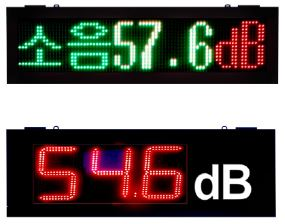
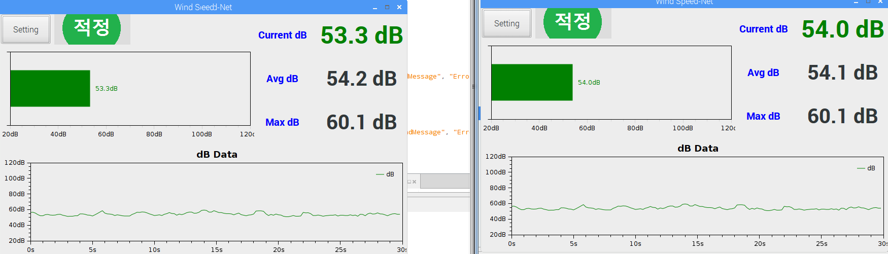
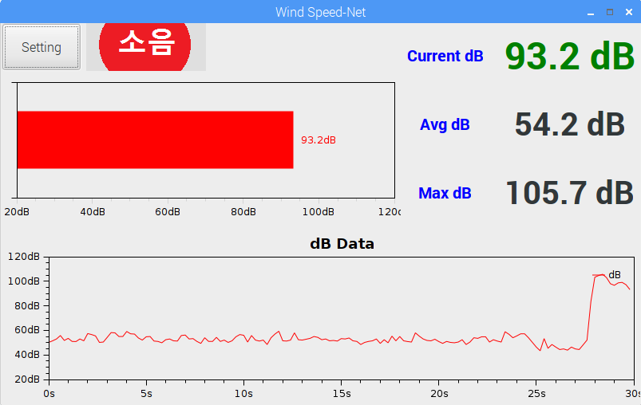
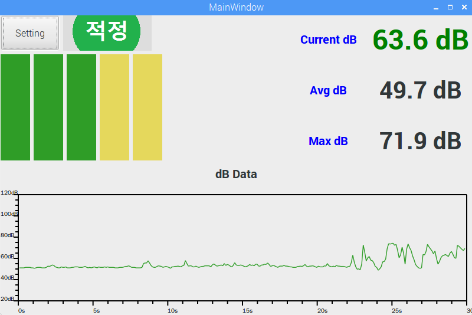
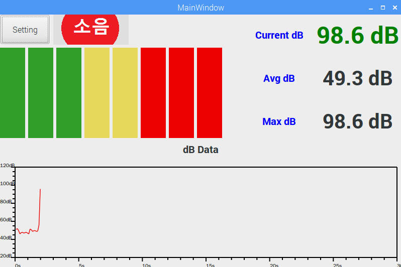
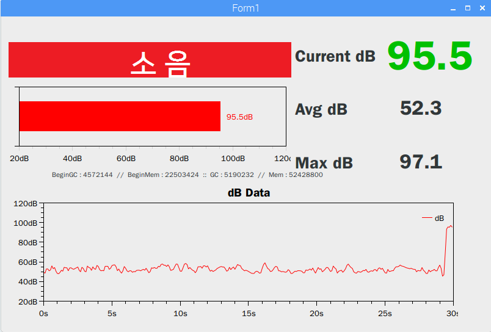
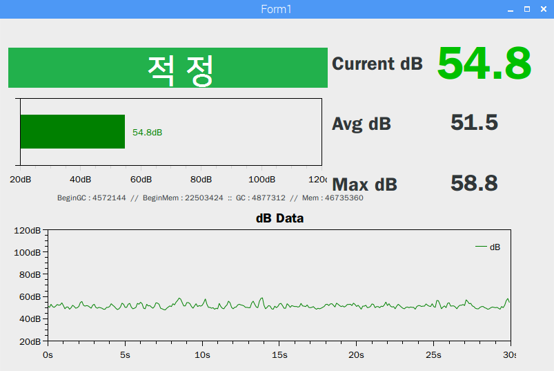

# 소음 측정 프로그램
## 프로젝트 소개
- 공사현장에서 적정 소음을 유지 하기 위해 만들어졌습니다. 소음 측정 센서를 이용하여 c#으로 모든 구현을 담당했습니다. 소음 측정 프로그램에 시리얼 통신으로 LED 전광판을 연동하여 측정되는 소음이 전광판에 노출되도록 구현되어있습니다.
- TCP통신을 하는 클라이언트와 서버 프로그램으로 구성되어있으며, 서버는 윈도우에서 실행되고, 클라이언트는 LED 전광판과 소음 측정 센서가 연결되어 있는 라즈베리파이에서 구동하며 서로 통신하며 소음 정보를 주고 받습니다. 서버는 전달받은 정보를 웹사이트에 전달하여 웹사이트에서도 소음 정보를 확인할 수 있게 구성되어 있습니다.

> 이런 형식으로 전광판에 노출됩니다.

</img>

- 초기에는 OxyPlot 라이브러리와 Winform을 사용하여 소음 정보를 전달해주려 하였습니다.

</img>
</img>
</img>
</img>
</img>
</img>
